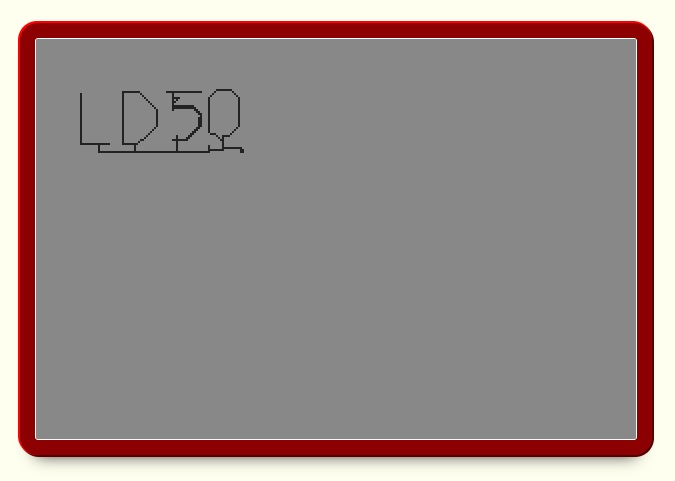

# Ludum Dare: Bare-bones

A simple, yet effective, ES5 game engine designed for use during Ludum Dare.

---

## Included Example Game

A simple Etch-a-Scetck style game has been provided as an example.

To run this example:

  1. Clone this repository to a known location on your hard-drive.
  2. Open a terminal, and navigate to the **parent** directory of where the reository was cloned.
  3. Start a web-server in this directory. (e.g. `python -m http.server`)
  4. Navigate to the example in your browser. (e.g. `localhost:8000/ldbb/example`)
  5. Enjoy!

The contols are:

  - `WASD`: Move pen around.
  - `Q`: Toggle background drawing. _(enable/disable pen)_